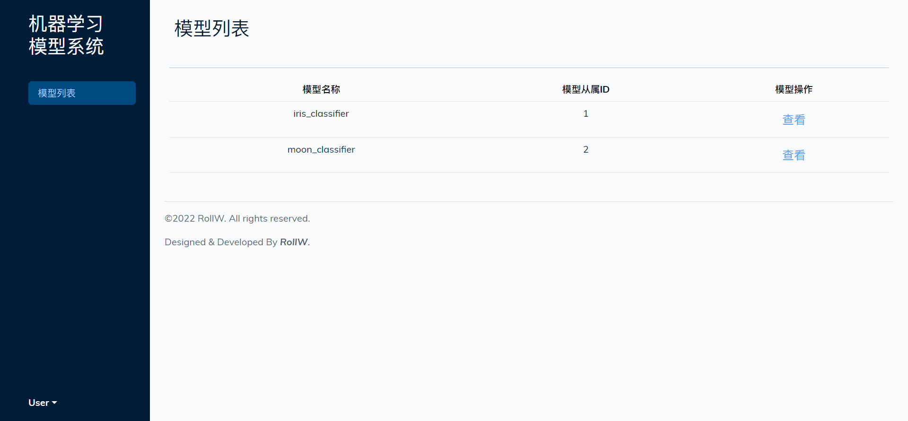
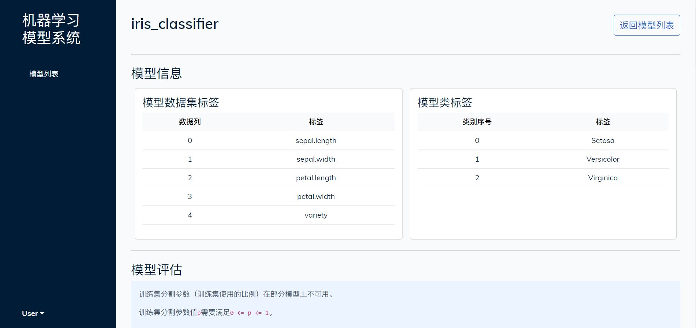
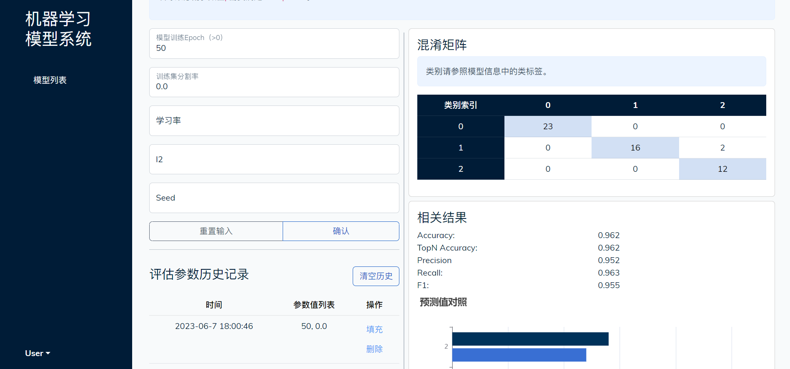
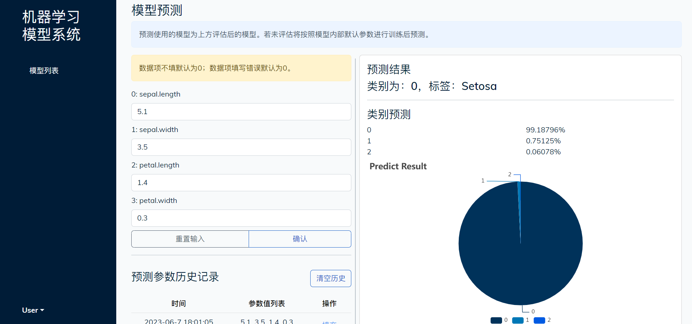

# Machine Learning Models Platform

2022 Software Engineering Course Final Project.

This project provides a platform framework for machine learning models.

## Introduction

It is based on the [Spring Boot](https://projects.spring.io/spring-boot/) framework.
For frontend, it is based on the [Vue.js](https://vuejs.org/) and [Bootstrap](http://getbootstrap.com/) framework.

> Notice:
> - User service was not implemented.
> - And this project only contains two model examples for demonstration.
> - There are still some unimplemented features or simplified implementations.
> - I18n is not supported. It is only available in Chinese for now.

## Requirements

- Java 17

## Screenshots

|      **Screenshot 1**       |      **Screenshot 2**       |
|:---------------------------:|:---------------------------:|
|  |  |
|      **Screenshots 3**      |      **Screenshots 4**      |
|  |  |

## License

```text
   Copyright (C) 2022 RollW

   Licensed under the Apache License, Version 2.0 (the "License");
   you may not use this file except in compliance with the License.
   You may obtain a copy of the License at

       http://www.apache.org/licenses/LICENSE-2.0

   Unless required by applicable law or agreed to in writing, software
   distributed under the License is distributed on an "AS IS" BASIS,
   WITHOUT WARRANTIES OR CONDITIONS OF ANY KIND, either express or implied.
   See the License for the specific language governing permissions and
   limitations under the License.
```
